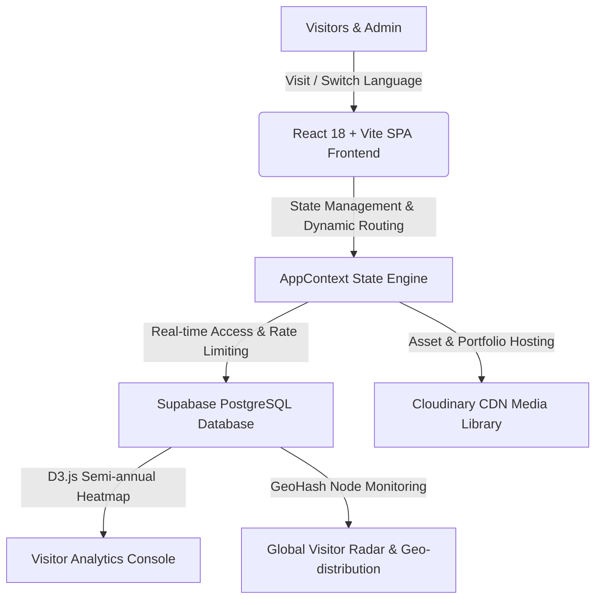

<div align="center">

# ⚡ KYVERO PORTFOLIO & MULTI-DIMENSIONAL ANALYTICS CONSOLE
### 🚀 Modern Neo-Brutalist Full-Stack Web Application & Visitor Intelligence Engine

[](https://www.typescriptlang.org/)
[](https://react.dev/)
[](https://tailwindcss.com/)
[](https://supabase.com/)
[](https://cloudinary.com/)
[](https://opensource.org/licenses/MIT)

[中文文档](./README_CN.md)

</div>

---

## 🎨 Design & Architecture Overview

Kyvero blends **Neo-Brutalist** visual aesthetics with a modern high-concurrency full-stack architecture. It features distinctive bold borders, high-contrast shadows, responsive layouts, and a sophisticated data analytics backend.



---

## 🌟 Core Features

| Module | Description | Technical Highlights |
| :--- | :--- | :--- |
| **🎨 Neo-Brutalist UI** | Elegant personal cards, skill matrices, open-source project displays, and social grids. | High-contrast visuals, seamless animations (`Motion`). |
| **📊 Analytics Heatmap** | GitHub-style heatmap showing 181 days (26 weeks) of visitor activity. | D3.js rendering, real-time sync with `analytics` table. |
| **🌍 Visitor Radar** | Interactive geo-distribution radar and domestic/overseas traffic monitoring. | Real-time stats, node latency detection, multi-dimensional filtering. |
| **🔒 Admin Console** | Password-protected dashboard (`/admin`) for full-site CRUD operations. | Brand customization, data backup, and one-click reset. |
| **🌐 Multilingual Engine** | Built-in support for 5 professional languages with dictionary management. | Simplified Chinese, Traditional Chinese, English, Japanese, Korean. |

---

## 🌐 Multilingual Support

The system features an enterprise-grade I18N dictionary management mechanism, ensuring professional accuracy of technical terms:

* **🇨🇳 Simplified Chinese (`zh-CN`)** —— Default System Language
* **🇭🇰 Traditional Chinese (`zh-TW`)** —— For HK, TW, and overseas users
* **🇺🇸 English (`en`)** —— International Standard
* **🇯🇵 Japanese (`ja`)** —— Localized for Japan
* **🇰🇷 Korean (`ko`)** —— Localized for Korea

---

## 📦 Getting Started

### 1. Clone & Install
```bash
git clone https://github.com/your-username/kyvero-portfolio-console.git
cd kyvero-portfolio-console
npm install
```

### 2. Environment Variables
Create a `.env` file in the root directory (refer to `.env.example`):
```env
VITE_SUPABASE_URL=your_supabase_project_url
VITE_SUPABASE_KEY=your_supabase_anon_key
VITE_CLOUDINARY_CLOUD_NAME=your_cloudinary_cloud_name
VITE_CLOUDINARY_UPLOAD_PRESET=your_cloudinary_preset
VITE_CLOUDINARY_API_KEY=your_cloudinary_api_key
VITE_CLOUDINARY_API_SECRET=your_cloudinary_api_secret
DEEPL_API_KEY=your_deepl_api_key
```

### 3. Initialize Supabase
1. Create a project on [Supabase Console](https://supabase.com/).
2. Open **SQL Editor**, copy and run the `supabase_schema.sql` script.
3. Tables such as `profiles`, `projects`, `tech_skills`, `experiences`, `social_links`, `media_items`, and `analytics` will be created automatically.

### 4. Run Development Server
```bash
npm run dev
```
The app will be available at `http://localhost:3000`.

---

## 🚢 Deployment Guide

Kyvero's backend is built with the **Hono** framework, supporting various Serverless and Edge platforms.

### 1. Core Configuration
Ensure the following variables are configured in your deployment platform:
- `VITE_SUPABASE_URL`
- `VITE_SUPABASE_KEY` (Supabase **service_role** key is recommended for backend operations)
- `DEEPL_API_KEY` (Server-side secret)

### 2. Platform Adapters
- **Cloudflare Workers**: Entry point at `src/api/adapters/cloudflare.ts`.
- **Vercel**: Entry point at `src/api/adapters/vercel.ts`.
- **AWS Lambda**: Entry point at `src/api/adapters/aws-lambda.ts`.
- **Node.js (Express)**: Standard entry point at `server.ts`.

### 3. Production Build
```bash
# Build both frontend and backend
npm run build

# Start production server
npm start
```

---

## 📄 License & Attribution

This project is licensed under a **Customized MIT License**:
* **Allowed**: Commercial use, modification, distribution, private use.
* **Mandatory**: Any website or application using this software **must** include a visible link back to the original GitHub repository in its user interface (e.g., in the footer).

See the [LICENSE](./LICENSE) file for the full text.

MIT License © 2026 Kyvero Portfolio Console.
