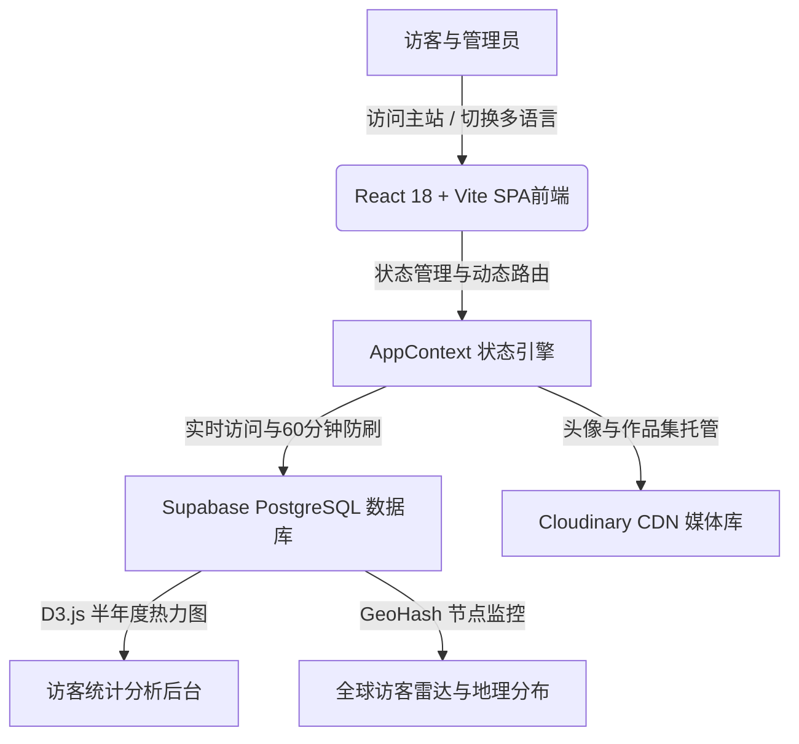

<div align="center">

# ⚡ KYVERO PORTFOLIO & MULTI-DIMENSIONAL ANALYTICS CONSOLE
### 🚀 Modern Neo-Brutalist Full-Stack Web Application & Visitor Intelligence Engine

[](https://www.typescriptlang.org/)
[](https://react.dev/)
[](https://tailwindcss.com/)
[](https://supabase.com/)
[](https://cloudinary.com/)
[](https://opensource.org/licenses/MIT)

</div>

---

## 🎨 视觉与架构美学 (Design & Architecture Overview)

Kyvero 融合了**硬核新粗野主义 (Neo-Brutalist)** 视觉美学与现代高并发全栈架构，拥有极具辨识度的粗边框、高对比度阴影、响应式布局以及精密的数据统计后台。



---

## 🌟 核心功能特性 (Core Features)

| 模块名称 | 功能简介 | 技术亮点 |
| :--- | :--- | :--- |
| **🎨 现代粗野美学主页** | 包含精美的个人卡片、技能掌握矩阵、开源项目展示与社交矩阵。 | 高对比度视觉、无缝动画切换 (`Motion`)。 |
| **📊 半年度访问热力图** | 类似 GitHub 风格的 181 天（26周）贡献热力矩阵。 | 基于 `D3.js` 精准渲染，实时对接云端 `analytics` 表。 |
| **🌍 全球访客动态雷达** | 交互式地理分布雷达与国内/海外节点流量监控。 | 实时统计、节点延迟探测、多维数据过滤。 |
| **🔒 沉浸式管理控制台** | 独立的密码保护通道 (`/admin`)，支持全站数据增删改查。 | 密码修改、系统品牌定制、数据备份与一键重置。 |
| **🌐 五国多语言引擎** | 内置 5 种专业技术语言支持，具备完整的字典对象管理。 | 简体中文、繁體中文、English、日本語、한국어。 |

---

## 🌐 多语言支持 (Multilingual Engine)

系统内置了企业级的 I18N 国际化字典对象管理机制，不依赖粗糙的实时翻译，确保技术名词的专业性与准确性：

* **🇨🇳 简体中文 (`zh-CN`)** —— 默认系统语言
* **🇭🇰 繁體中文 (`zh-TW`)** —— 港台与海外繁中用户
* **🇺🇸 English (`en`)** —— 国际化标准英语
* **🇯🇵 日本語 (`ja`)** —— 日文本地化适配
* **🇰🇷 한국어 (`ko`)** —— 韩文本地化适配

---

## 📦 快速开始与本地开发 (Getting Started)

### 1. 克隆项目与安装依赖
```bash
git clone https://github.com/your-username/kyvero-portfolio-console.git
cd kyvero-portfolio-console
npm install
```

### 2. 配置环境变量
在根目录下创建 `.env` 文件（可参考 `.env.example`）：
```env
VITE_SUPABASE_URL=your_supabase_project_url
VITE_SUPABASE_KEY=your_supabase_anon_key
VITE_CLOUDINARY_CLOUD_NAME=your_cloudinary_cloud_name
VITE_CLOUDINARY_UPLOAD_PRESET=your_cloudinary_preset
VITE_CLOUDINARY_API_KEY=your_cloudinary_api_key
VITE_CLOUDINARY_API_SECRET=your_cloudinary_api_secret
```

### 3. 初始化 Supabase 数据库
1. 登录 [Supabase 控制台](https://supabase.com/) 创建项目。
2. 打开 **SQL Editor**，将根目录下的 `supabase_schema.sql` 脚本完整复制并执行。
3. 数据库将自动创建 `profiles`, `projects`, `tech_skills`, `experiences`, `social_links`, `media_items`, `analytics` 等核心数据表。

### 4. 启动本地开发服务器
```bash
npm run dev
```
项目将在 `http://localhost:3000` 实时运行。

---

## 🚢 生产构建与部署 (Deployment)

```bash
# 执行生产打包（Vite + Esbuild 服务端打包）
npm run build

# 启动生产服务
npm start
```

---

## 📄 许可证与开源声明 (License & Attribution)

本项目采用 **自定义 MIT 许可证** 开源：
* **允许**：商业使用、修改、分发、私用。
* **强制要求**：在使用本系统的任何网站或应用中，**必须**在 UI 界面（如页脚）保留一个指向原 GitHub 仓库的可视化链接。

详细条款请参阅 [LICENSE](./LICENSE) 文件。

MIT License © 2026 Kyvero Portfolio Console.
